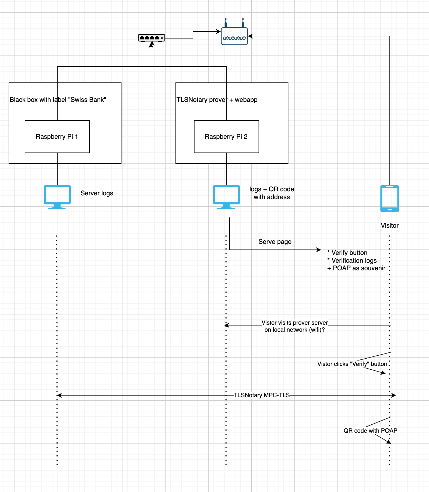

# TLSNotary DevConnect Demo

This project contains the code for a TLSNotary at DevConnect25.

The demo consists of 2 Raspberry Pis: one runs a Swiss bank and one runs a TLSNotary Prover. Visitors can verify the bank balance by participating in TLSNotary's MPC-TLS protocol via a webapp.

## Demo Architecture

Three parties in the MPC-TLS protocol:
* **Swiss Bank** - Fake bank with EF balance data ([swissbank/](swissbank/))
* **Prover Server** - TLSNotary prover service ([prover-demo/server/](prover-demo/server/))
* **Verifier Webapp** - Browser-based verifier for visitors ([prover-demo/webapp/](prover-demo/webapp/))



**Note:** Roles are swapped from typical usage - visitors act as verifiers (not provers) to avoid entering real secrets in a public setting.

## Hosted Deployments

* Bank: https://swissbank.tlsnotary.org
* Server: https://devconnect.tlsnotary.org
* Local setup: https://devconnect-local.tlsnotary.org

### Local Development

```bash
# Terminal 1 - Swiss Bank
cd swissbank
cargo run --release
# Access at: http://localhost:3000/dashboard

# Terminal 2 - Prover Server
cd prover-demo/server
cargo run --release
# Running on: ws://localhost:9816

# Terminal 3 - Verifier Webapp
cd prover-demo/webapp
npm ci
npm run dev
# Access at: http://localhost:8080
```

### Docker (Recommended)

```bash
# Swiss Bank
cd swissbank
docker-compose up --build

# Prover + Verifier
cd prover-demo
docker-compose up --build
# Access at: https://devconnect-local.tlsnotary.org
```
