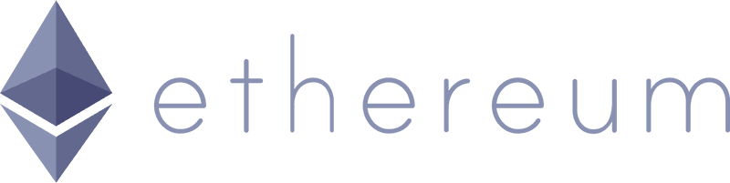
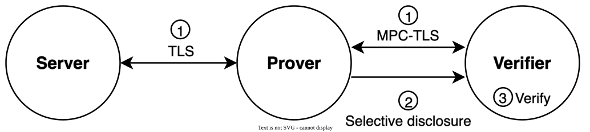
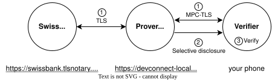

 

# TLSNotary 

Privacy first, secure an open source **zkTLS**.

Unlock existing HTTPS data.

---

# 🌍 The Problem

Most information today lives behind HTTPS.  
It’s encrypted, but not **verifiable**.

# 💡 Solution

Verify the data with **MPC-TLS**, the multi-party version of TLS.

---

# 🧩 The Demo

Verify a bank balance interactively with the TLSNotary protocol

---

# 🔍 Why It Matters

TLSNotary bridges the Web and Ethereum:
- Verifiable off-chain data
- Auditable public information
- Private attestations and credentials
- On-chain verifiers and zk integrations
